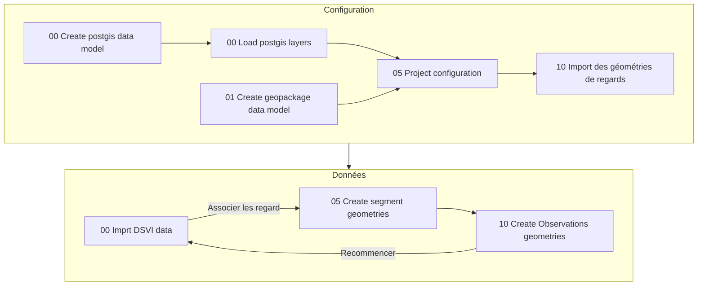

# Drain Sewer Visual Inspection

QGIS plugin for drain and sewer systems visual inspection coding system (EN 13508-2)

```mermaid
flowchart TD

Create_Postgis[00 Create postgis data model]
Load_Postgis[00 Load postgis layers]
Create_Gpkg[01 Create geopackage data model]
Config_Project[05 Project configuration]
Import_Regards[10 Import des géométries de regards]
Import_Dsvi[00 Imprt DSVI data]
Create_Segment[05 Create segment geometries]
Create_Obs[10 Create Observations geometries]

subgraph Configuration
Create_Postgis --> Load_Postgis
Load_Postgis --> Config_Project
Create_Gpkg --> Config_Project
Config_Project --> Import_Regards
end

subgraph Données
Create_Obs -- Recommencer --> Import_Dsvi
Import_Dsvi -- Associer les regard --> Create_Segment
Create_Segment --> Create_Obs
end

Configuration --> Données
```
