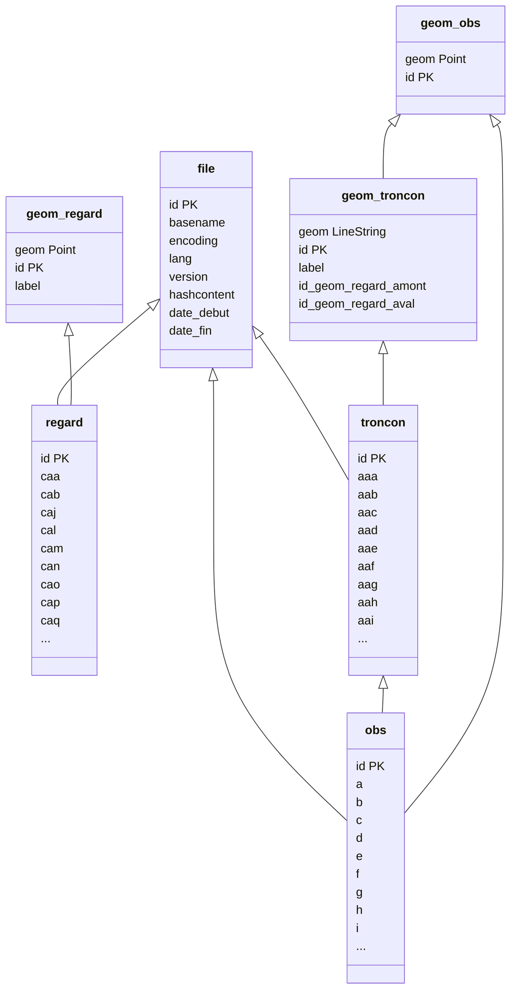

---
hide:
  - navigation
---

# Modèle de données

## Relations

??? info "Légende"
    Flèche pleine : relation de projet

    Losange vide : jointure spatiale

## Tables

??? info "Légende"
    Champ géométrique en *italique*

    Champ de clé primaire en **gras**

    <!-- Champ de clé étrangère cliquable avec la mention "FK" -->

### Geom Regard

| ID | Name | Type | Alias |
|:-:|:-:|:-:|:-:|
||*geom*|Point||
|1|**id**|qlonglong|Identifiant|
|2|label|QString|Référence|

### Geom Troncon

| ID | Name | Type | Alias |
|:-:|:-:|:-:|:-:|
||*geom*|LineString||
|1|**id**|qlonglong|Identifiant|
|2|label|QString|Référence|
|3|id_geom_regard_amont|int|Identifiant de la géométrie de regard amont|
|4|id_geom_regard_aval|int|Identifiant de la géométrie de regard aval|

### Obs

| ID | Name | Type | Alias |
|:-:|:-:|:-:|:-:|
|1|**id**|qlonglong|Identifiant|
|2|a|QString|Code principal|
|3|b|QString|Caractérisation 1|
|4|c|QString|Caractérisation 2|
|5|d|QString|Quantification 1|
|6|e|QString|Quantification 2|
|7|f|QString|Remarques|
|8|g|QString|Emplacement circonférentiel 1|
|9|h|QString|Emplacement circonférentiel 2|
|10|i|double|Emplacement longitudinal ou vertical|
|11|j|QString|Code de défaut continu|
|12|k|QString|Assemblage|
|13|l|QString|Champ de description de l'emplacement|
|14|m|QString|Référence de photographie|
|15|n|QString|Référence de vidéo|
|16|id_troncon|int|Identifiant de troncon|
|17|id_file|int|Identifiant de fichier|

### File

| ID | Name | Type | Alias |
|:-:|:-:|:-:|:-:|
|1|**id**|qlonglong|Id|
|2|basename|QString|Nom|
|3|encoding|QString|Encodage|
|4|lang|QString|Langue|
|5|version|QString|Version|
|6|hashcontent|QString|Hash|
|7|date_debut|QString||
|8|date_fin|QString||

### Troncon

| ID | Name | Type | Alias |
|:-:|:-:|:-:|:-:|
|1|**id**|qlonglong|Identifiant|
|2|aaa|QString|Référence de tronçon|
|3|aab|QString|Référence du nœud de départ|
|4|aac|QString|Coordonnées du nœud de départ|
|5|aad|QString|Référence du nœud 1|
|6|aae|QString|Coordonnées du nœud 1|
|7|aaf|QString|Référence du nœud 2|
|8|aag|QString|Coordonnées du nœud 2|
|9|aah|QString|Emplacement longitudinal du point de départ de la canalisation latérale|
|10|aai|QString|Emplacement circonférentiel du point de départ de la canalisation latérale|
|11|aaj|QString|Emplacement|
|12|aak|QString|Sens de l'écoulement|
|13|aal|QString|Type d'emplacement|
|14|aam|QString|Autorité responsable|
|15|aan|QString|Ville ou village|
|16|aao|QString|Quartier|
|17|aap|QString|Nom du réseau d'assainissement|
|18|aaq|QString|Propriété foncière|
|19|aat|QString|Référence du nœud 3|
|20|aau|QString|Coordonnées du nœud 3|
|21|aav|QString||
|22|aba|QString|Norme|
|23|abb|QString|Système de codage initial|
|24|abc|QString|Point de référence longitudinal|
|25|abe|QString|Méthode d'inspection|
|26|abf|QString|Date d'inspection|
|27|abg|QString|Heure d'inspection|
|28|abh|QString|Nom de l'inspecteur|
|29|abi|QString|Référence de fonction de l’inspecteur|
|30|abj|QString|Référence de fonction de l’employeur|
|31|abk|QString|Support de stockage des images vidéo|
|32|abl|QString|Support de stockage des photographies|
|33|abm|QString|Système de position sur la bande vidéo|
|34|abn|QString|Référence de photographie|
|35|abo|QString|Référence de vidéo|
|36|abp|QString||
|37|abq|double|Longueur|
|38|abr|QString||
|39|abs|QString||
|40|aca|QString|Forme|
|41|acb|QString|Hauteur|
|42|acc|QString|Largeur|
|43|acd|QString|Matériau|
|44|ace|QString|Type de revêtement|
|45|acf|QString|Matériau de revêtement|
|46|acg|QString|Longueur unitaire de conduite|
|47|ach|QString|Profondeur au nœud de départ|
|48|aci|QString|Profondeur au nœud d’arrivée|
|49|acj|QString|Type de branchement ou de collecteur|
|50|ack|QString|Utilisation du branchement ou du collecteur|
|51|acl|QString|Position stratégique|
|52|acm|QString|Nettoyage|
|53|acn|QString|Année de mise en service|
|54|ada|QString|Précipitations|
|55|adb|QString|Température|
|56|adc|QString|Régulation du débit|
|57|ade|QString|Remarque générale|
|58|aea|QString|Modification Référence de vidéo|
|59|aeb|QString|Modification Référence de photographie|
|60|aec|QString|Modification Section transversale|
|61|aed|QString|Modification Matériau|
|62|aee|QString|Modification Revêtement|
|63|aef|QString|Modification Longueur unitaire de conduite|
|64|aeg|QString|Modification Précipitations|
|65|id_regard1|int|Identifant regard 1|
|66|id_regard2|int|Identifant regard 2|
|67|id_regard3|int|Identifant regard 3|
|68|id_geom_troncon|int|Identifiant de la géométrie de troncon|
|69|id_file|int|Identifiant du fichier|

### Geom Obs

| ID | Name | Type | Alias |
|:-:|:-:|:-:|:-:|
||*geom*|Point||
|1|**id**|qlonglong|Identifiant|

### Regard

| ID | Name | Type | Alias |
|:-:|:-:|:-:|:-:|
|1|**id**|qlonglong|Identifiant|
|2|caa|QString|Référence de nœud|
|3|cab|QString|Coordonnées du nœud|
|4|caj|QString|Emplacement|
|5|cal|QString|Type d'emplacement|
|6|cam|QString|Autorité responsable|
|7|can|QString|Ville ou village|
|8|cao|QString|Quartier|
|9|cap|QString|Nom du réseau d’assainissement|
|10|caq|QString|Propriété foncière|
|11|car|QString|Type de nœud|
|12|cas|QString|Niveau du tampon|
|13|cba|QString|Norme|
|14|cbb|QString|Système de codage initial|
|15|cbc|QString|Point de référence vertical|
|16|cbd|QString|Point de référence circonférentiel|
|17|cbe|QString|Méthode d'inspection|
|18|cbf|QString|Date d'inspection|
|19|cbg|QString|Heure d'inspection|
|20|cbh|QString|Nom de l'inspecteur|
|21|cbi|QString|Référence de fonction de l’inspecteur|
|22|cbj|QString|Référence de fonction de l’employeur|
|23|cbk|QString|Stockage des images vidéo|
|24|cbl|QString|Format de stockage des photographies|
|25|cbm|QString|Système d'enregistrement de la position sur bande|
|26|cbn|QString|Référence de photographie|
|27|cbo|QString||
|28|cca|QString|Forme de l’accès|
|29|ccb|QString|Largeur de l’accès|
|30|ccc|QString|Longueur de l’accès|
|31|ccd|QString|Matériau|
|32|ccg|QString|Longueur unitaire des éléments de chambre|
|33|cck|QString|Utilisation du réseau d'assainissement|
|34|ccl|QString|Position stratégique|
|35|ccm|QString|Nettoyage|
|36|ccn|QString|Année de mise en service|
|37|cco|QString|Forme du tampon|
|38|ccp|QString|Matériau du tampon|
|39|ccq|QString|Largeur du tampon|
|40|ccr|QString|Longueur du tampon|
|41|ccs|QString|Types de système de descente|
|42|cda|QString|Précipitations|
|43|cdb|QString|Température|
|44|cdc|QString|Régulation du débit|
|45|cdd|QString|Atmosphère|
|46|cde|QString|Remarque générale|
|47|cea|QString|Modification Référence de vidéo|
|48|ceb|QString|Modification Référence de photographie|
|49|ced|QString|Modification Matériau|
|50|cef|QString|Modification Longueur unitaire de chambre|
|51|ceg|QString|Modification Précipitations|
|52|ceh|QString|Modification Types de système de descente|
|53|id_geom_regard|int|Identifiant de la géométrie de regard|
|54|id_file|int|Identifiant du fichier|
